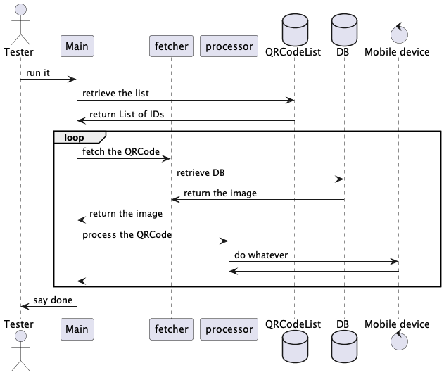

This project was created in order to propose a solution to a question raised at

- https://forum.katalon.com/t/how-to-parallel-testing-on-mobile-and-pc/68989

You can run the "Test Cases/Main" script.

You will see some output like in console as follows:

```
...
2022-09-02 10:48:32.023 INFO  c.k.k.c.keyword.builtin.CommentKeyword   - qrcodeId: qr1
...
2022-09-02 10:48:32.913 INFO  c.k.k.c.keyword.builtin.CommentKeyword   - qrcodeId=qr1; BufferedImage@4fad94a7: type = 12 IndexColorModel: #pixelBits = 1 numComponents = 3 color space = java.awt.color.ICC_ColorSpace@475835b1 transparency = 1 transIndex   = -1 has alpha = false isAlphaPre = false BytePackedRaster: width = 200 height = 200 #channels 1 xOff = 0 yOff = 0
...
2022-09-02 10:48:32.949 INFO  c.k.k.c.keyword.builtin.CommentKeyword   - qrcodeId: qr2
...
2022-09-02 10:48:33.222 INFO  c.k.k.c.keyword.builtin.CommentKeyword   - qrcodeId=qr2; BufferedImage@3f2ef586: type = 12 IndexColorModel: #pixelBits = 1 numComponents = 3 color space = java.awt.color.ICC_ColorSpace@475835b1 transparency = 1 transIndex   = -1 has alpha = false isAlphaPre = false BytePackedRaster: width = 200 height = 200 #channels 1 xOff = 0 yOff = 0
...
2022-09-02 10:48:33.232 INFO  c.k.k.c.keyword.builtin.CommentKeyword   - qrcodeId: qr3
...
2022-09-02 10:48:33.408 INFO  c.k.k.c.keyword.builtin.CommentKeyword   - qrcodeId=qr3; BufferedImage@4215838f: type = 12 IndexColorModel: #pixelBits = 1 numComponents = 3 color space = java.awt.color.ICC_ColorSpace@475835b1 transparency = 1 transIndex   = -1 has alpha = false isAlphaPre = false BytePackedRaster: width = 200 height = 200 #channels 1 xOff = 0 yOff = 0
...
```

The Main will do the following:

1. The Main retrieve a list of IDs of QRCodes from a local CSV file
2. The Main iterates of the the list
3. The Main calls sub-test cases for each ID: "fetch image" and "process image"
4. The qrcode_fetcher fetches an PNG image from database (in fact, a local folder)
5. The qrcode_processor process the QRCode image (in fact, print it.toString() to console)

This is just a skeletal implementation to demostrate the structure of Test Cases in Katalon Studio.




You should be able to extend this so that it fullfills your own test scenarios.

You should be able to extend the "fetcher" so that it talk to browser to fetch QRCode image from the database while utilizing "WebUI.*" keywords.

You should be able to extends the "processor" so that it sends the QRCode image into a Mobile device and let it consume as you like.

----

Please note I used "WebUI.*" keywords and "Mobile.*" keywords intermixed in this project. It is just possible.

You may have an misunderstanding that a Test Case in Katalon Studio is designated either one of the Project Type (WebUI, WebService, Mobiel, Windows, ...). It is not right. You can use keywords of all types.

The "Project Type" property of a Katalon's project is significant only for the GUI of Katalon Studio. The GUI refers to the project type just to decide which GUI components (labels, buttons, drop-downs, ...) to be displayed on a window; GUI of WebUI project will not display "Mobile" menu; GUI of Mobile project will not display "WebUI" menu; that's whole reason why the project type property is there.

But your test scripts can call all keyword, the project type is not significant for your scripts.


